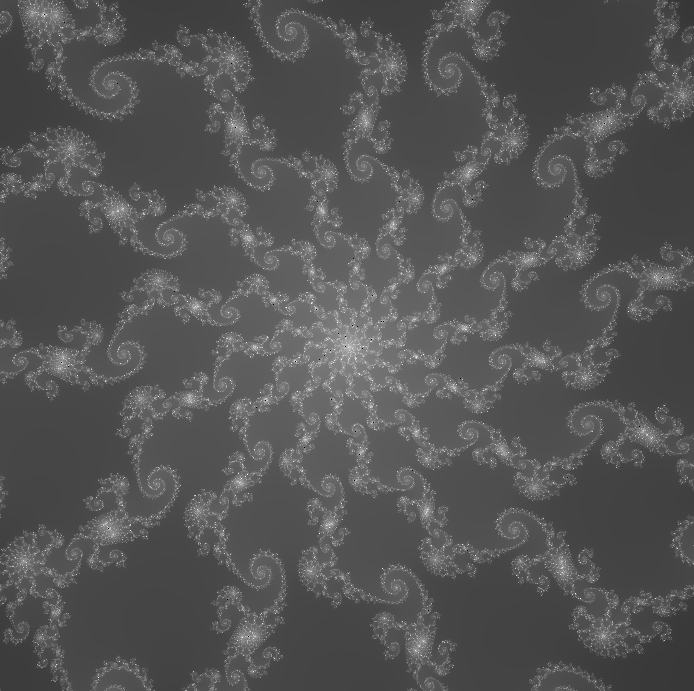
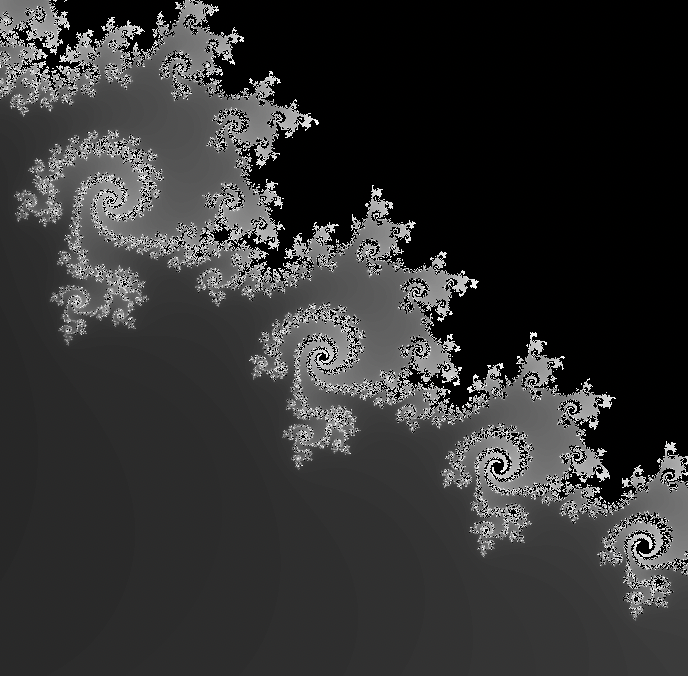
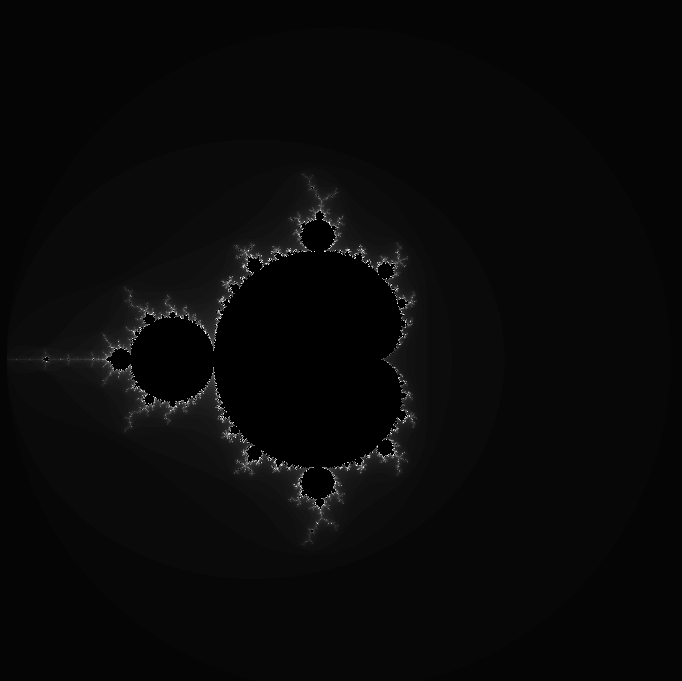
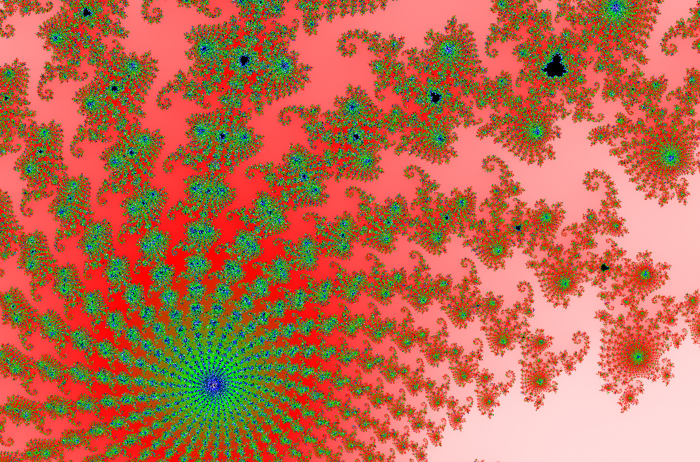

# fract-ol - Fractal explorer

Tutorial:

zoom 			| use mouse SCROLL

change iterations 	| MINUS button and PLUS button

change render scale	| DEL button and INTRO button

---

SI, YA SE QUE LAS IMAGENES DE MUESTRA SON FEAS

---

- [ ] SOLUCIONAR PROBLEMAS DE COLOR ANTES DE SEGUIR CON EL P PARSEO

- [ ] Arreglar cuando solo se introduce un numero en -i y -c
- [ ] Arreglar cuando solo se introduce la letra de un comando seguida de otra (-ix)
- [ ] Arreglar y organizar el parseo de mierda por dios
- [ ] NORMA NORMA NORMA NORMA NORMA NORMA NORMA
- [ ] Go to place
- [ ] ATOF
- [ ] Parseo de argumentos
	- [x] Nombre del fractal
	- [ ] Condiciones iniciales del fractal 
- [ ] Reorganizar ciertas partes del codigo
- [ ] Mapear el numero de iteraciones a una paleta de colores
- [ ] Menu lateral - Botones y colision mouse/boton
- [ ] Botones para ir a sitios cool del fractal
- [ ] Crear una estructura con las opciones de comando disponibles para usar
- [ ] Check-option
- [ ] Print Mouse coordinates
- [ ] No todas ls opciones funcionan con todos los tipos de fractales
- [ ]

- [x] SCREEN coords TO WORLD coords
- [x] Hacer que el zoom siga el raton sin irse al centro
- [x] Anadir el resto de fractales obligatorios

## OPTIONAL
---
- [ ] Dividir la pantalla en 2 para anadir opciones
- [ ] Julia en segunda pantallas 
- [ ] Optimizar usando un buffer mas pequeno y renderizar solo cuando sea necesario (la image este estatica)
