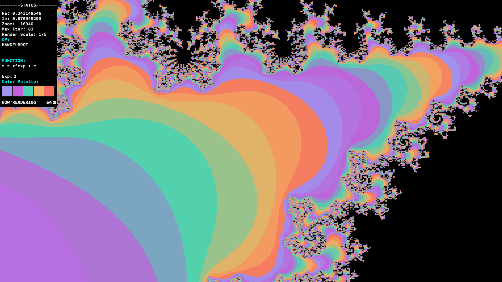

# fract-ol - Fractal explorer

	Press M to open status menu
	Press X to render current image
	Press C to change color palette
	Press J to change to julia set (using screen center as initial conditions)
	Press - to decrease iteration count
	Press + to increase iteration count
	Press DEL to decrease resolution
	Press INTRO to increase resolution
	Use SCROLL WHEEL to zoom

---

### TODO

- Reorganizar codigo
- Pasar la norma
- Crear pulsadores en el menu
- Generalizar el exponente de las funciones
- Arreglar parseo
- Cambiar por teclado la funcion usada
- Que los nuevos render tengan nuevos nombres
- Hacer otro menu negro (imagen) para mostrar los controles
