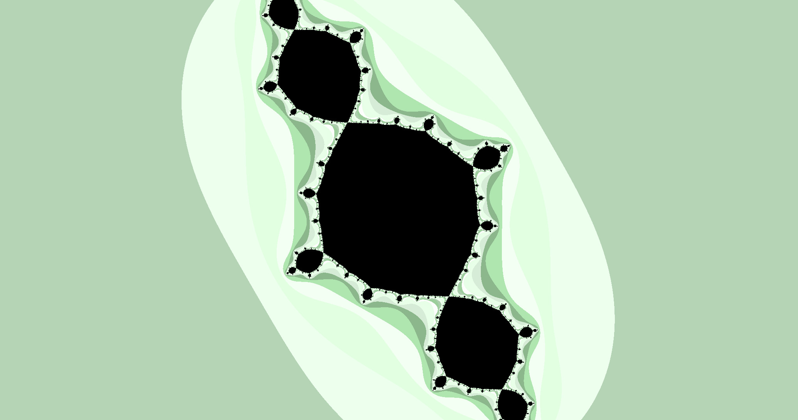

# fract-ol - Fractal explorer

	COMPILE USING "make fast" FOR A BETTER EXPERIENCE
	MOVE USING A SMALL RESOLUTION FOR A BETTER EXPERIENCE
	
	Press M to open status menu
	Press X to save current frame (2K) to ./renders/new.ppm (overrides previous)
	Press C to change color palette
	Press MLB to change to Julia set (using mouse coordinates)
	Press MRB to change to go back to Mandelbrot set at previous pos
	Press F to cycle between available fractal functions
	Press J to move Julia set using mouse (according to mouse coordinates)
		Press again to go back to Mandelbrot
		Pres SPACE once you find a nice set to prevent Julia from moving
	Press - to decrease iteration count
	Press + to increase iteration count
	Press DEL to decrease resolution
	Press INTRO to increase resolution
	Use SCROLL WHEEL to zoom
	Use WASD or ARROWS to move

---

### TODO

- Que los nuevos render tengan nuevos nombres
- Hacer otro menu negro (imagen) para mostrar los controles
- Anadir boton para volver a estado inicial
- Export zoom in video...
